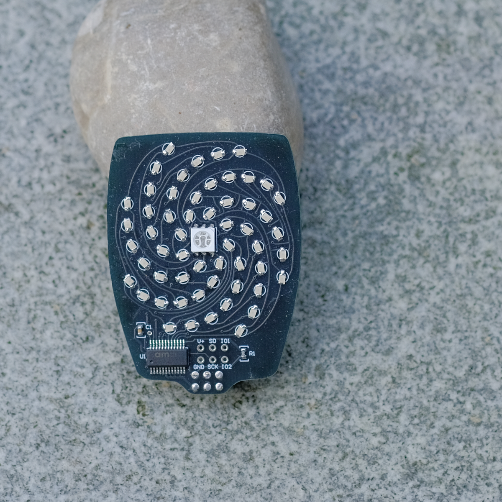

The Spiral Matrix Petal is maximum blinky goodness, with an RGB LED at the center.  

It's based on the AS1115 I2C display driver, and there are hidden goodies in the [datasheet](../../../resources/datasheets/AS1115_DS000206_1-00.pdf) if you're so inclined.

