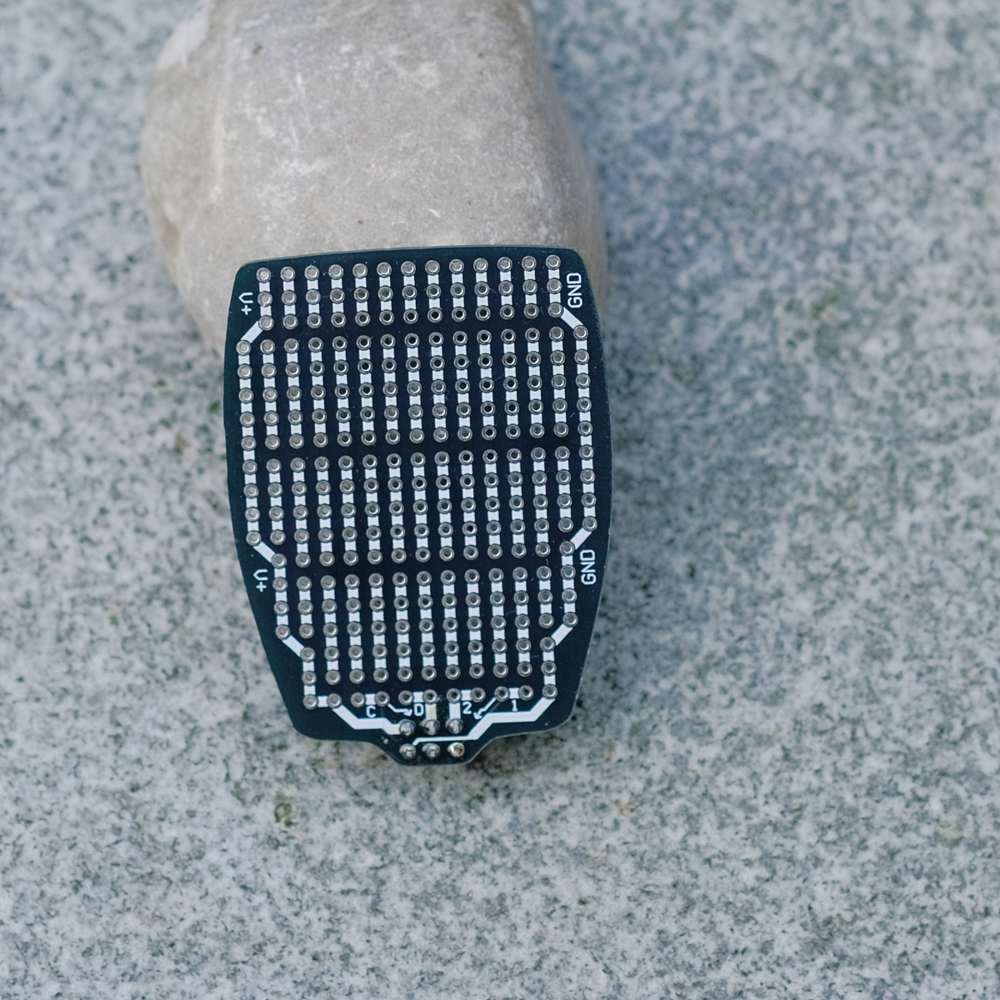

The Pure Proto Petal is a simple breakout board for all of the SAO lines.  Power and ground snake up the sides, while the I2C and GPIO lines have solder points in the middle.  The rest is space for your creativity!  What you see is what you get.

